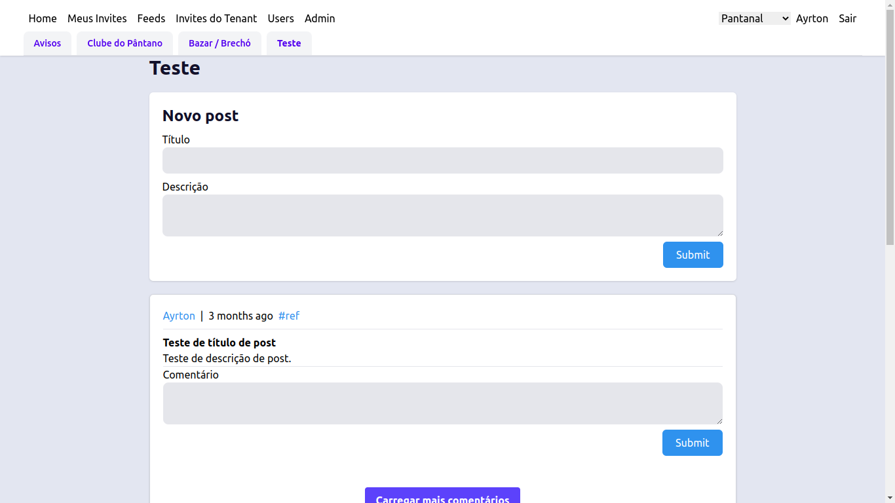

# Welcome to Feed App!

Uma rede social (estilo feed/facebook) multitenant.

- [Remix Docs](https://remix.run/docs)

O objetivo dessa implementação é testar várias funcionalidades e métodos de deploy do Remix, bem como explorar as ferramentas de gestão de projeto do GitHub.

- Multitenant: o conteúdo de um tenant não se mistura com o conteúdo de outro.
- Multifeed: cada tenant possui vários feeds.
- Convites: um usuário pode entrar em um tenant por meio de um convite.

## Tecnologias utilizadas

- Tailwind;
- Remix;
- Prisma;
- Cloudflare Workers (em migração para Fly.io);
- TypeScript.
